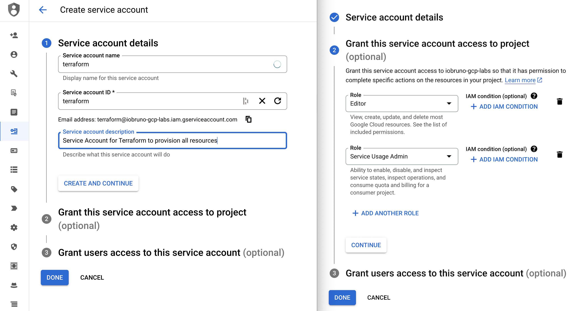
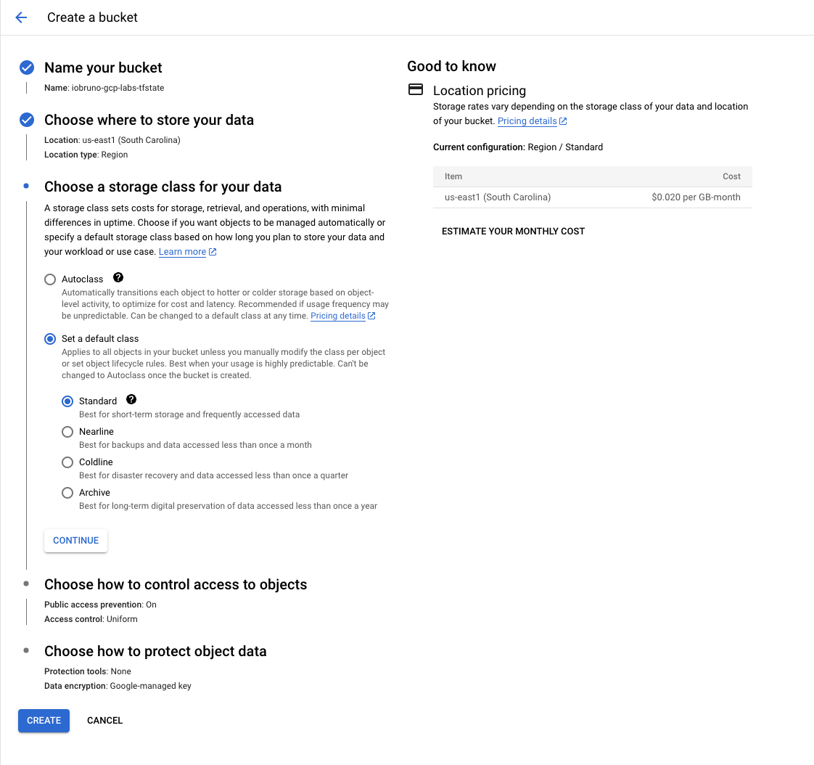

# Terraform for Google Cloud Platform


## Initial Setup - IAM Service Account

Download and install [Google Cloud CLI](https://cloud.google.com/sdk/docs/install-sdk) for your platform, following the instructions on the page.

On the GCP Console, create a new `Service Account` with the roles of:
- Editor
- Service Usage Admin

Next, access the created service_account, and create a 'New Key' with `Key type: JSON`, and save it somewhere safe on your workstation




Now, export the environment variables `GOOGLE_APPLICATION_CREDENTIALS` pointing to the full path where the .json credentials file was downloaded/saved:

```shell
export GOOGLE_APPLICATION_CREDENTIALS=/path/to/gcp-credentials.json
```


## Up & Running with Terraform

**1.**: Save Terraform state on GCP:

In [Google Cloud Storage](https://console.cloud.google.com/storage/browser?hl=en&project=iobruno-gcp-labs), create a bucket that Terraform will use as its backend to save state:




**2.** Configure Terraform backend for GCS:

**2.1.** In [backend.tf](backend.tf), edit the `bucket` to the name of the bucket you created in the step above

```terraform
terraform {
    backend "gcs" {
        bucket  = "iobruno-gcp-labs-tfstate"
    }
}
```

**2.2.** Initialize Terraform modules and backend with:
```shell
terraform init
```

**2.3.** Edit the variables on [terraform.tfvars](terraform.tfvars):  

Edit the values of the variables (`project_id`, `lakehouse_raw_bucket`, `bigquery_raw_nyc_tlc`) to your suit your project


**2.4.** Create the resources with Terraform
```shell
terraform plan
```
```shell
terraform apply --auto-approve
```


## Terraform Best Practises

Following the best practises for Terraform,

Variables that might contain sensitive information were set on [terraform.tfvars](terraform.tfvars), which, **for educational purposes only**, is set **not** to be ignored in version control.


## TODO:
- [x] Configure Google Cloud Storage as the backend for Terraform States
- [x] Extract sensitive data from variables.tf into *.tfvars
- [ ] Consider using Terraform modules as the project expands further