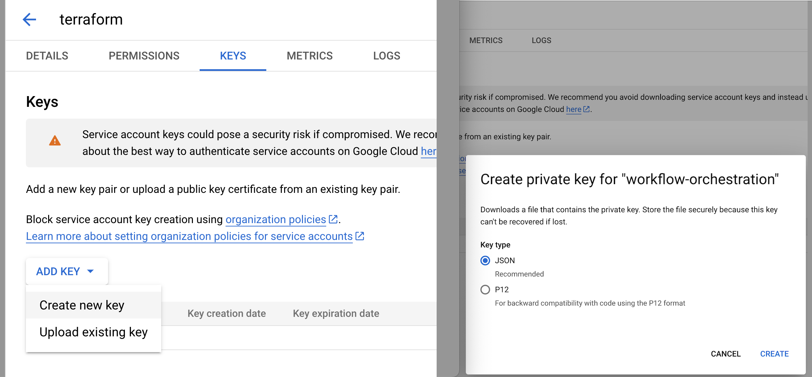

# Terraform for Google Cloud Platform


## Initial Setup - IAM Service Account

Download and install [Google Cloud CLI](https://cloud.google.com/sdk/docs/install-sdk) for your platform, following the instructions on the page

Next, on the GCP Console in the web, create a new `Service Account` with the roles of:
- Editor
- Service Usage Admin


Next, access the service_account created, create a New Key (Key type: JSON) and save it somewhere safe on your workstation




Now, export an environment variables named `GOOGLE_APPLICATION_CREDENTIALS` pointing to the full path where the .json credentials file was downloaded/saved:

```shell
export GOOGLE_APPLICATION_CREDENTIALS=/some/path/to/gcp-credentials.json
```


## Up & Running with Terraform

**1.**: Save Terraform state on GCP:

In [Google Cloud Storage](https://console.cloud.google.com/storage/browser?hl=en&project=iobruno-gcp-labs), create a bucket that Terraform will use as its backend to save state:


**2.** Configure Terraform backend for GCS:

**2.1.** In [backend.tf](backend.tf), edit the `bucket` to the name of the bucket you created in the step above

```terraform
terraform {
    backend "gcs" {
        bucket  = "iobruno-gcp-labs-tfstate"
    }
}
```

**2.2.** Initialize Terraform backend with:
```shell
terraform init
```

**2.3s.** Terraform Plan & Apply
```shell
terraform plan
```

```shell
terraform apply
```


## Terraform Best Practises

Following the best practises for Terraform,

The variables that might contain sensitive information were set on [terraform.tfvars](terraform.tfvars) (which, **for educational purposes only**, is set to *not* be ignored in version control - **do NOT use this for real-world scenarios**)


## TODO:
- [x] Configure Google Cloud Storage as the backend for Terraform States
- [x] Extract sensitive data from variables.tf into *.tfvars
- [ ] Consider using Terraform modules as the project expands further