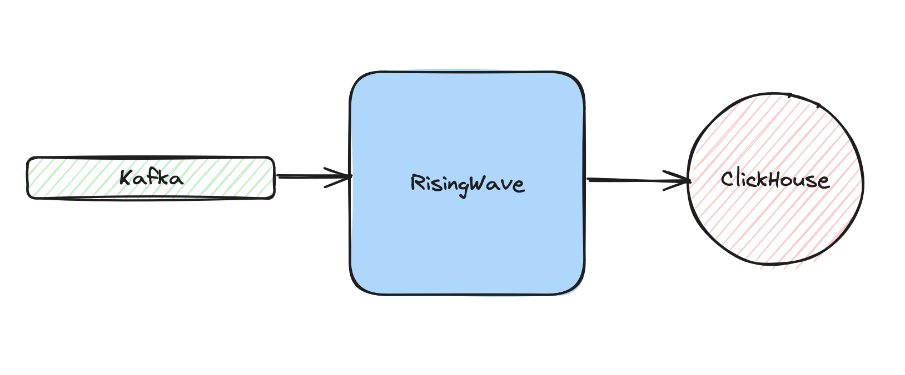
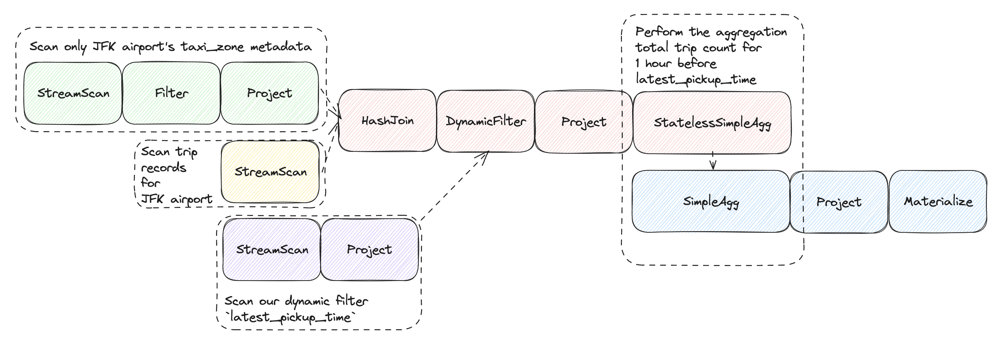

# Stream Processing with RisingWave





## Tech Stack
- [RisingWave]() (Stream Processing)
- [Kafka](https://docs.confluent.io/platform/current/installation/configuration/index.html) (Data Source)
- [ClickHouse](https://clickhouse.com/docs/en/sql-reference/statements/create/table) (Sink)
- [MinIO](https://min.io/docs/minio/container) (Object Storage)
- [etcd](https://etcd.io/docs/v2.3/docker_guide/) (Metadata Storage)
- [PDM](https://pdm-project.org/latest/usage/dependency/)
- [Ruff](https://docs.astral.sh/ruff/configuration/)
- [Docker](https://docs.docker.com/get-docker/)

## Up & Running 

### Developer Setup
**1.** Create and activate a virtualenv for Python 3.11 with conda:

```shell
conda create -n risingwave python=3.11 -y
conda activate risingwave
```

**2.** Install the dependencies on pyproject.toml:
```shell
pdm sync
```

**3.** Start Kafka Cluster and RisingWave
```shell
docker compose -f docker-compose.kafka.yml up -d
docker compose up -d 
```

**4.** Export ENV VARS to connect to Kafka:
```shell
export KAFKA_BOOTSTRAP_SERVERS=localhost:9092
```

**5.** Run seed.py script:

The `seed.py` file contains the logic to process the data and populate RisingWave. Here we'll:

- Process the `taxi_zones` data and insert it into RisingWave. This is just ingested with DML over `psycog`, since it's a small dataset.
- Process the `yellow_taxi_trip_data` and ingest into Kafka (which will be the source for RisingWave)

```shell
# For Streaming: chunk_size=100 records (default), delay=1 sec (default)
python seed.py --use-streaming
```

```shell
# For Batch: chunk_size=100_000 records (Default), delay=10 secs (enforced)
python seed.py --delay=10
```

### Configure Kafka as DataSource for RisingWave
To run the sql script from the cmd line, I'm using [usql](https://github.com/xo/usql). It's like `psql`, 
but it supports a wide variety of DBs, not just postgres. 
```shell
usql postgres://root@localhost:4566/dev -f sql/risingwave/table/yellow_taxi_trips.sql
```

#### Validating the ingested data
```sql
usql postgres://root@localhost:4566/dev -c 'select * from taxi_zones'
```

```sql
usql postgres://root@localhost:4566/dev -c 'select count(1) from yellow_taxi_trips';
```

### RisingWave: Materialized Views

#### Materialized View: 'Latest 1min Trip Data':
```sql
create materialized view if not exists latest_1min_trip_data as
select
    puz.zone as pickup_zone,
    doz.zone as dropoff_zone,
    tpep_pickup_datetime,
    tpep_dropoff_datetime
from
    yellow_taxi_trips ytt
inner join
    taxi_zones puz on ytt.PULocationID = puz.location_id
inner join
    taxi_zones doz on ytt.DOLocationID = doz.location_id
where
    tpep_dropoff_datetime > now() - interval '1 minute';
```

#### Materialized View: 'Total Airport Pickups'
```sql
create materialized view if not exists total_airport_pickups as
select
    tz.zone,
    count(*) AS num_trips
from
    yellow_taxi_trips ytt
inner join 
    taxi_zones tz on ytt.PULocationID = tz.location_id
where 
    tz.zone like '%Airport'
group by 
    tz.zone;
```

#### Materialized View: Airport pickups from JFK Airport, 1 hour before the latest pickup
```sql
create materialized view if not exists airport_pu as
select
    tpep_pickup_datetime,
    pulocationid
from
    yellow_taxi_trips ytt
inner join
    taxi_zones tz on ytt.PULocationID = tz.location_id
where
    tz.borough = 'Queens' 
    and tz.zone = 'JFK Airport';
```

Next, we also want to keep track of the latest pickup
```sql
create materialized view if not exists latest_jfk_pickup as
select
    max(tpep_pickup_datetime) as latest_pickup_time
from
    yellow_taxi_trips ytt
inner join
    taxi_zones tz on ytt.PULocationID = tz.location_id
where
    tz.borough = 'Queens' 
    and tz.zone = 'JFK Airport';
```

Finally, let's get the counts of the pickups from JFK Airport, 1 hour before the latest pickup
```sql
create materialized view if not exists jfk_pickups_1hr_before as
select
    count(*) AS num_trips
from
    airport_pu air
inner join
    latest_jfk_pickup jfk on air.tpep_pickup_datetime > jfk.latest_pickup_time - interval '1 hour'
inner join 
    taxi_zones tz on air.PULocationID = tz.location_id
where
    tz.borough = 'Queens' 
    and tz.zone = 'JFK Airport';
```

Simplified query plan:



#### Materialized View: Top 10 busiest zones in the last 1 min
```sql
create materialized view if not exists busiest_zones_1_min as 
select
    tz.zone AS dropoff_zone,
    count(*) AS last_1_min_dropoffs
from
    yellow_taxi_trips ytt
inner join 
    taxi_zones tz on ytt.DOLocationID = tz.location_id
where
    ytt.tpep_dropoff_datetime > (now() - interval '1' minute)
group by
    tz.zone
order by
    last_1_min_dropoffs desc
limit
    10;
```

#### Materialized View: Longest trips
```sql
create materialized view if not exists longest_trip_1_min as
select
    tpep_pickup_datetime,
    tpep_dropoff_datetime,
    puz.zone as pickup_zone,
    doz.zone as dropoff_zone,
    trip_distance
from
    yellow_taxi_trips ytt
        inner join
    taxi_zones puz on ytt.PULocationID = puz.location_id
        inner join
    taxi_zones doz on ytt.DOLocationID = doz.location_id
order by
    trip_distance desc
limit
    10;
```

#### Materialized View: Average Fare Amount vs Number of rides
```sql
create materialized view if not exists avg_fare_amount as
select
    avg(fare_amount) as avg_fare_amount_per_min,
    count(*) as num_rides_per_min,
    window_start,
    window_end
from
    tumble(yellow_taxi_trips, tpep_pickup_datetime, interval '1' minute)
group by
    window_start, 
    window_end
order by
    num_rides_per_min;
```

### RisingWave Dashboard
You can always access the [RisingWave Dashboard](http://localhost:5691) to see the query plans.
```shell
open http://localhost:5691
```

### Tabulator for Real-time Dataviz 
Start the backend which queries RisingWave:
```shell
python webapp/api.py
```

Next, start the frontend, in a separate terminal
```shell
# macOS
open webapp/index.html

# Linux
xdg-open webapp/index.html
```

### RisingWave: Sink to ClickHouse
Start ClickHouse server on docker with: 
```shell
docker compose -f docker-compose.clickhouse.yml up -d
```

Connect to ClickHouse using your preferred Database tool, and run:
```sql
create table avg_fare_amount(
    avg_fare_amount_per_min numeric,
    num_rides_per_min Int64,
) engine = ReplacingMergeTree
primary key (
    avg_fare_amount_per_min, 
    num_rides_per_min
);
```

Next, connect to RisingWave, and create the Sink to ClickHouse table we created above
```sql
create sink if not exists avg_fare_amount_sink as 
select
    avg_fare_amount_per_min,
    num_rides_per_min
from
    avg_fare_amount
with (
    connector = 'clickhouse',
    type = 'append-only',
    clickhouse.url = 'http://clickhouse:8123',
    clickhouse.user = 'clickhouse',
    clickhouse.password = 'clickhouse',
    clickhouse.database = 'default',
    clickhouse.table='avg_fare_amount',
    force_append_only = 'true'
);
```

Now, you should be able to query the data on `ClickHouse`:
```sql
select max(avg_fare_amount_per_min) 
from avg_fare_amount;
```
```sql
select min(avg_fare_amount_per_min) 
from avg_fare_amount;
```

## References
- https://tutorials.risingwave.com/docs/category/basics
- https://docs.risingwave.com/docs/current/risingwave-docker-compose/
- https://docs.risingwave.com/docs/current/ingest-from-kafka/
- https://docs.risingwave.com/docs/current/data-ingestion/
- https://docs.risingwave.com/docs/current/sink-to-clickhouse/
- https://docs.risingwave.com/docs/current/data-delivery/

## TODO:
- [x] PEP-517: Packaging and dependency management with PDM
- [x] Code format/lint with Ruff
- [X] Kafka as Data Source for RisingWave Stream Processing
- [X] ClickHouse as Data Sink
- [ ] Integrate with Confluent Schema Registry to process Protobuf records 
- [ ] AWS S3/GCS Delta Lake as Data Sink
