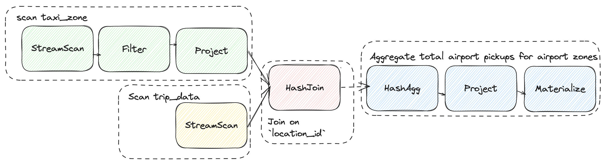

# Stream Processing in SQL with RisingWave


## Tech Stack
- RisingWave (Stream Processing)
- Kafka (Data Source)
- Clickhouse (Sink)
- MinIO (Storage)
- Etcd (Metadata Storage)

## Up & Running 

```shell
docker compose up -d 
```

#### Initialize Kafka and Rising Wave with some data
The `seed.py` file contains the logic to process the data and populate RisingWave.

Here we:
1. Process the `taxi_zone` data and insert it into RisingWave. This is just ingested with DML over `psycog`, since it's a small dataset.
2. Process the `trip_data` and insert it into RisingWave. This is ingested via Kafka.

In order to simulate real-time data, we will replace the `timestamp` fields in the `trip_data` with `timestamp`s close to the current time.

Let's start ingestion into RisingWave by running it:
```bash
python seed.py update
```

Now we can let that run in the background.

Let's open another terminal to create the trip_data table:
```bash
psql -f risingwave-sql/table/trip_data.sql
```

You may look at their definitions by running:
```bash
psql -c 'show tables;'
```


#### Validating the ingested data

First, we verify `taxi_zone`, since this is static data:
```sql
select * from taxi_zone;
```

We will also query for recent data, to ensure we are getting real-time data.

```sql
select  
    pulocationid, 
    dolocationid, 
    tpep_pickup_datetime, 
    tpep_dropoff_datetime
from 
    trip_data 
where 
    tpep_dropoff_datetime > now() - interval '1 minute';
```


#### Materialized View: 'Latest Trip Data':
We can join this with `taxi_zone` to get the names of the zones and create a materialized view out of it

```sql
create materialized view latest_1min_trip_data as
select
    taxi_zone.Zone as pickup_zone, 
    taxi_zone_1.Zone as dropoff_zone, 
    tpep_pickup_datetime, 
    tpep_dropoff_datetime
from
    trip_data
join 
    taxi_zone on trip_data.PULocationID = taxi_zone.location_id
join 
    taxi_zone as taxi_zone_1 on trip_data.DOLocationID = taxi_zone_1.location_id
where 
    tpep_dropoff_datetime > now() - interval '1 minute';
```

We can now query the MV to see the latest data:
```sql
select * 
from latest_1min_trip_data 
order by tpep_dropoff_datetime DESC;
```


### Materialized View 1: Total Airport Pickups

The first materialized view we create will be to count the total number of pickups at the airports.

This is rather simple, we just need to filter the `PULocationID` to the airport IDs.
 
Recall `taxi_zone` contains metadata around the taxi zones, so we can use that to figure out the airport zones.
```sql
describe taxi_zone;
```

Let's first get the zone names by looking at the `taxi_zone` table:
```sql
select * 
from taxi_zone 
where Zone LIKE '%Airport';
```

Then we can simply join on their location ids to get all the trips:
```sql
select
    *
from
    trip_data
inner join 
    taxi_zone on trip_data.PULocationID = taxi_zone.location_id
where
    taxi_zone.Zone LIKE '%Airport';
```

And finally apply the `count(*)` aggregation for each airport.  
We can now create a Materialized View to constantly query the latest data:

```sql
create materialized view total_airport_pickups as 
select
    tz.Zone,
    count(*) AS cnt,
from
    trip_data t
inner join 
    taxi_zone tz on t.PULocationID = tz.location_id
where 
    tz.Zone LIKE '%Airport'
group by 
    tz.Zone;
```

We can now query the MV to see the latest data:
```sql
select * from total_airport_pickups;
```

#### Visualize the Data
Go to your local [RisingWave Dashboard](http://localhost:5691) to see the query plan.

Provided a simplified a simpler version here:




#### Materialized View 2: Airport pickups from JFK Airport, 1 hour before the latest pickup

We can adapt the previous MV to create a more specific one.
We no longer need the `GROUP BY`, since we are only interested in 1 taxi zone, JFK Airport.

```sql
create materialized view airport_pu as
select
    tpep_pickup_datetime,
    pulocationid
from
    trip_data t
inner join
    taxi_zone tz on t.PULocationID = tz.location_id
where
    tz.Borough = 'Queens' 
    and tz.Zone = 'JFK Airport';
```

Next, we also want to keep track of the latest pickup
```sql
create materialized view latest_jfk_pickup as
select
    max(tpep_pickup_datetime) AS latest_pickup_time
from
    trip_data t
inner join
    taxi_zone tz on t.PULocationID = tz.location_id
where
    tz.Borough = 'Queens' 
    and taxi_zone.Zone = 'JFK Airport';
```

Finally, let's get the counts of the pickups from JFK Airport, 1 hour before the latest pickup
```sql
create materialized view jfk_pickups_1hr_before as
select
    count(*) AS cnt
from
    airport_pu
inner join
    latest_jfk_pickup on airport_pu.tpep_pickup_datetime > latest_jfk_pickup.latest_pickup_time - interval '1 hour'
inner join 
    taxi_zone on airport_pu.PULocationID = taxi_zone.location_id
where
    taxi_zone.Borough = 'Queens' 
    and taxi_zone.Zone = 'JFK Airport';
```

Simplified query plan:


#### Materialized View 3: Top 10 busiest zones in the last 1 minute

First we can write a query to get the counts of the pickups from each zone.

```sql
select
    taxi_zone.Zone AS dropoff_zone,
    count(*) AS last_1_min_dropoff_cnt
from
    trip_data t
inner join 
    taxi_zone tz on t.DOLocationID = tz.location_id
group by BY
    tz.Zone
order by 
    last_1_min_dropoff_cnt desc
limit 10;
```

Next, we can create a temporal filter to get the counts of the pickups from each zone in the last 1 minute.

```sql
create materialized view busiest_zones_1_min as 
select
    taxi_zone.Zone AS dropoff_zone,
    count(*) AS last_1_min_dropoff_cnt
from
    trip_data t
inner join
    taxi_zone tz on t.DOLocationID = tz.location_id
where
    t.tpep_dropoff_datetime > (now() - interval '1' minute)
group by
    tz.Zone
order by 
    last_1_min_dropoff_cnt desc
limit 
    10;
```

Didn't include the query plan this time, you may look at the dashboard.

#### Materialized View 4: Longest trips

Here, the concept is similar as the previous MV, but we are interested in the top 10 longest trips for the last 5 min.

First we create the query to get the longest trips:
```sql
select
    tpep_pickup_datetime,
    tpep_dropoff_datetime,
    taxi_zone_pu.Zone as pickup_zone,
    taxi_zone_do.Zone as dropoff_zone,
    trip_distance
from
    trip_data t
inner join 
    taxi_zone pu on t.PULocationID = pu.location_id
inner join 
    taxi_zone do on t.DOLocationID = do.location_id
order by
    trip_distance Desc
limit 
    10;
```

Then we can create a temporal filter to get the longest trips for the last 5 minutes:
```sql
create materialized view longest_trip_1_min as 
select
    tpep_pickup_datetime,
    tpep_dropoff_datetime,
    taxi_zone_pu.Zone as pickup_zone,
    taxi_zone_do.Zone as dropoff_zone,
    trip_distance
from
    trip_data t
inner join 
    taxi_zone pu on t.PULocationID = pu.location_id
inner join 
    taxi_zone do on t.DOLocationID = do.location_id
where
     t.tpep_pickup_datetime > (NOW() - INTERVAL '5' MINUTE)
order by
    trip_distance desc
limit
    10;
```

Didn't include the query plan this time, you may look at the dashboard.

After this, you may run the visualization dashboard to see the data in real-time.

Start the backend which queries RisingWave:
```bash
python server.py
```

#### Visualize Data from Materialized View 3 and 4

Start the frontend, in a separate terminal

```bash
### macOS
open webapp/index.html

### Linux
xdg-open webapp/index.html
```


#### Materialized View 5: Average Fare Amount vs Number of rides

How does `avg_fare_amt` change relative to number of pickups per minute?

We use something known as a [tumble window function](https://docs.risingwave.com/docs/current/sql-function-time-window/#tumble-time-window-function), to compute this.

```sql
create materialized view avg_fare_amt as
select
    avg(fare_amount) AS avg_fare_amount_per_min,
    count(*) AS num_rides_per_min,
    window_start,
    window_end
from
    tumble(trip_data, tpep_pickup_datetime, interval '1' minute)
group by
    window_start, 
    window_end
order by
    num_rides_per_min asc;
```

For each window we compute the average fare amount and the number of rides.

That's all for the materialized views!

Now we will see how to sink the data out from RisingWave.

#### How to sink data from RisingWave to Clickhouse

Reference:
- https://docs.risingwave.com/docs/current/data-delivery/
- https://docs.risingwave.com/docs/current/sink-to-clickhouse/

We have done some simple analytics and processing of the data in RisingWave.

Now we want to sink the data out to Clickhouse, for further analysis.

We will create a Clickhouse table to store the data from the materialized views.

```sql
create table avg_fare_amt(
    avg_fare_amount_per_min numeric,
    num_rides_per_min Int64,
) engine = ReplacingMergeTree
primary key (
    avg_fare_amount_per_min, 
    num_rides_per_min
);
```

We will create a Clickhouse sink to sink the data from the materialized views to the Clickhouse table.

```sql
create sink if not exists avg_fare_amt_sink as 
select 
    avg_fare_amount_per_min, 
    num_rides_per_min 
from 
    avg_fare_amt
with (
    connector = 'clickhouse',
    type = 'append-only',
    clickhouse.url = 'http://clickhouse:8123',
    clickhouse.user = '',
    clickhouse.password = '',
    clickhouse.database = 'default',
    clickhouse.table='avg_fare_amt',
    force_append_only = 'true'
);
```

Now we can run queries on the data ingested into clickhouse:
```bash
clickhouse-client-term
```

Run some queries in `Clickhouse`
```sql
select max(avg_fare_amount_per_min) from avg_fare_amt;
select min(avg_fare_amount_per_min) from avg_fare_amt;
```


## References
- https://tutorials.risingwave.com/docs/category/basics
- https://docs.risingwave.com/docs/current/risingwave-docker-compose/
- https://docs.risingwave.com/docs/current/ingest-from-kafka/
- https://docs.risingwave.com/docs/current/data-ingestion/

## TODO
- T.B.D.
